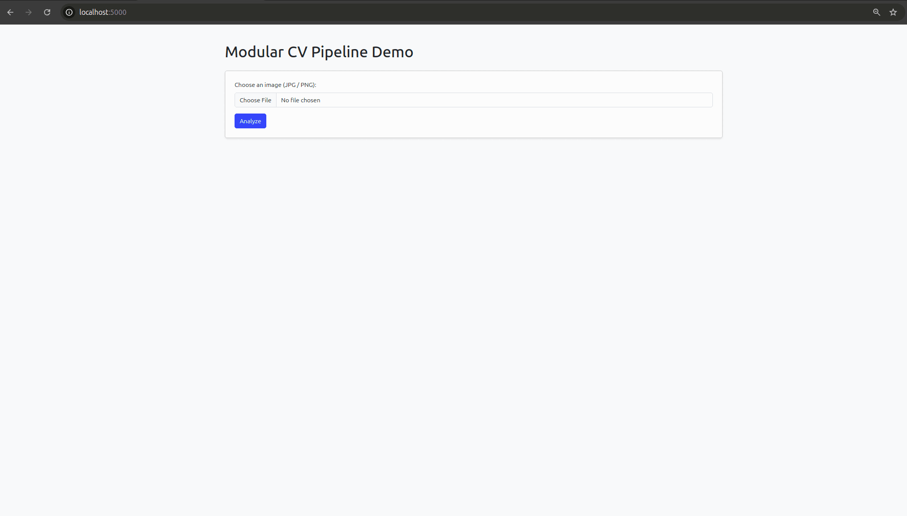

readme_content = """<!-- Open Graph / Twitter Card -->
<meta property="og:title" content="Modular CV Pipeline – Flask + YOLOv11"/>
<meta property="og:image" content="images/cv_pipeline-demo.gif"/>
<meta name="twitter:card" content="summary_large_image"/>

# 🖼️ Modular Computer-Vision Pipeline

[](#-quick-start)
[](#-project-layout)
[](#-key-features)
[%20%7C%20AGPL--3.0%20(Dependency)-blue)](...)

<p align="center">
  
</p>

A **production-minded, plug-and-play computer-vision stack** that chains multiple deep-learning models behind a single Flask endpoint.  
Upload any picture → get back richly-annotated detections **and** the raw JSON you’d feed into the next service.

---

## 🛠️ Tech stack overview

| Layer | Technology | Why |
|-------|------------|-----|
| **Detector** | Ultralytics **YOLOv11n** | Fast, tiny (5 MB), GPU/CPU friendly |
| **Resolvers** | FaceNet (embeddings) • Custom car classifier • Road-sign OCR | Each bbox routed to a specialised model |
| **API/UI** | Flask (+ Bootstrap) | Simple upload form & JSON API |
| **Serving** | Gunicorn (3 workers) | Production-grade WSGI |
| **Packaging** | **Docker** (`python:3.11-slim`) | Zero-setup deploy |

---

## ✨ Key features — portfolio highlights

1. **Clean modular router** – Enable/disable any resolver by toggling one line in `cv_core/main.py`.
2. **CUDA-aware & FP16** – Automatic half-precision on GPU, safe CPU fallback.
3. **Config via ENV** – Override weight paths, device (`cpu / cuda`), per-class thresholds without editing code.
4. **Server-side overlay** – Bounding-box renderer with class labels & confidences.
5. **100 % JSON-serialisable** – All numpy types converted to native floats/ints, ensuring seamless downstream use.
6. **One-command Docker** – Slim base image (~400 MB) with only the OS libs you need.
7. **Roadmap baked in** – Shows forward-thinking mindset for hiring managers.

---

## 📄 License  

**MIT for all original source code in this repository.**

⚠️ **Third-party notice:**  
The pipeline relies on the **Ultralytics YOLO** library, which is released under **GNU AGPL v3**.  
When you *distribute* a Docker image (or any other build) that bundles Ultralytics code, the combined work must satisfy AGPL v3 terms (or you need a commercial licence from Ultralytics).  
See `LICENSE` and `THIRD_PARTY_NOTICES` for full details.

---

## 🚀 Quick start

> Requires **Docker ⩾ 20.10**

```bash
git clone https://github.com/Sergey-swift/cv_pipeline.git
cd cv_pipeline

# Build image (~2 min first time)
docker build -t cv-pipeline .

# Run container
docker run --rm -p 5000:5000 cv-pipeline
